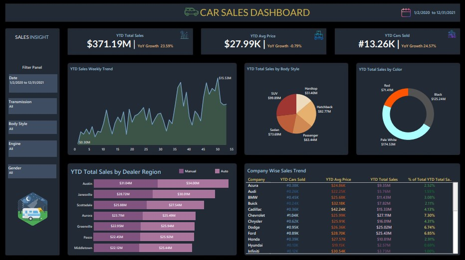

# Car Sales Dashboard

## Table of Contents
1. [Project Overview](#1-project-overview)
2. [Project Objectives](#2-project-objectives)
3. [Project Tools](#3-project-tools)
4. [Repository Structure](#4-repository-structure)
5. [Dataset Overview](#5-dataset-overview)
6. [Dashboard Overview](#6-dashboard-overview)
7. [Dashboard Screenshot](#7-dashboard-screenshot)
8. [Key Insights](#8-key-insights)
9. [Recommendations](#9-recommendations)
10. [Assumptions & Limitations](#10-assumptions--limitations)
11. [Future Enhancements](#11-future-enhancements)
12. [Author](#12-author)

## 1. Project Overview

The Car Sales Dashboard is a Tableau-based analytics project designed to explore vehicle sales performance across different manufacturers, dealer regions, vehicle categories, and customer segments. The dashboard consolidates key sales metrics and interactive visualizations to provide insights into revenue trends, sales volume, pricing performance, and customer preferences. By enabling users to analyze sales data from multiple perspectives, the dashboard supports a deeper understanding of performance patterns and business outcomes.

## 2. Project Objectives

The objective of this project is to develop an interactive Tableau dashboard that provides a comprehensive view of vehicle sales performance. The dashboard is designed to analyze key sales metrics, including total sales, average selling price, and vehicles sold, while tracking year-over-year performance trends. It also enables the exploration of sales distribution across manufacturers, vehicle body styles, colors, and dealer regions, helping users identify patterns in customer preferences and sales activity. Through interactive visualizations and filtering capabilities, the dashboard supports the effective analysis and communication of sales insights.

## 3. Project Tools

* **Tableau** — Dashboard development, data visualization, and interactive reporting.
* **CSV Dataset** — Source data used for sales analysis, trend identification, and performance evaluation.
* **Git & GitHub** — Version control, project organization, and documentation management.

## 4. Repository Structure

```text
Car-Sales-Dashboard/
│
├── dashboard/
│   └── Car Sales Dashboard.twbx
│
├── data/
│   └── Car Sales Data.xlsx
│
├── docs/
│   ├── business-requirements.md
│   └── insights-report.md
│
├── images/
│   └── Car Sales Dashboard.jpg
│
├── LICENSE
└── README.md
```

## 5. Dataset Overview

The dataset contains vehicle sales transaction records and customer-related information used to analyze sales performance and purchasing trends. Key attributes include vehicle manufacturer, model, body style, transmission type, color, engine specifications, sales price, dealer region, and customer demographics. These fields support the exploration of revenue performance, customer preferences, and regional sales distribution.

## 6. Dashboard Overview

The dashboard consists of KPI cards, trend visualizations, comparative charts, and interactive filters that enable users to analyze vehicle sales performance from multiple perspectives. Users can monitor revenue growth, evaluate sales volume trends, compare manufacturer performance, assess regional sales distribution, and explore customer purchasing preferences through a single interactive interface.

## 7. Dashboard Screenshot


## 8. Key Insights
- YTD Total Sales reached $371.19M, with a 23.59% year-over-year increase.
- Vehicle sales volume grew by 24.75%, totaling 13.26K cars sold.
- SUVs generated the highest sales among all vehicle body styles.
- Pale White and Black vehicles accounted for the largest share of sales by color.
- Automatic transmission vehicles consistently outsold manual vehicles across all dealer regions.
- Sales performance varied across regions, with Austin recording the highest sales among the displayed dealer locations.
- Manufacturer contributions differed, with Chevrolet, Ford, and Dodge among the leading contributors to total sales.

## 9. Recommendations
- Increase inventory allocation for SUV models, as they generate the highest sales among all vehicle body styles.
- Prioritize stocking Pale White and Black vehicles to better align inventory with observed customer purchasing preferences.
- Expand the availability of automatic transmission vehicles, given their consistently stronger sales performance across dealer regions.
- Conduct further analysis of top-performing dealer regions to identify practices that may be replicated in lower-performing markets.
- Review sales strategies for lower-performing vehicle body styles to identify opportunities for improving market performance.
- Strengthen partnerships and promotional activities around high-performing manufacturers to capitalize on existing sales momentum.
- Analyze seasonal sales patterns to better align inventory planning and marketing campaigns with periods of increased demand.

## 10. Assumptions & Limitations

### Assumptions
- The dataset is assumed to be complete and sufficiently representative for sales performance analysis.
- Vehicle pricing and sales records are assumed to be accurate and free from significant data entry errors.
- Dealer regions are treated as independent sales locations for comparative analysis.
- Year-over-Year (YOY) metrics are calculated based on the data available within the dataset.

### Limitations
- The analysis is limited to the data provided and may not reflect real-world market conditions.
- External factors such as economic conditions, competitor activities, promotions, or seasonality are not included in the dataset.
- Customer behavior is analyzed using available demographic attributes only and may not capture all purchasing influences.
- Insights and recommendations are based solely on historical sales records and should not be interpreted as predictive outcomes.

## 11. Future Enhancements
- Incorporate profit and cost metrics to enable profitability analysis alongside sales performance.
- Add customer segmentation analysis to explore purchasing patterns across different demographic groups.
- Introduce forecasting models to estimate future sales trends and demand patterns.
- Expand regional analysis with geographic mapping visualizations for improved location-based insights.
- Include inventory and stock-level data to support inventory planning and vehicle demand analysis.
- Develop manufacturer and model-level performance dashboards for more detailed sales monitoring.
- Integrate real-time or automated data refresh capabilities to support ongoing business reporting.
- Add advanced drill-through functionality to enable deeper exploration of sales performance across regions, vehicle categories, and customer segments.

## 12. Author

**Godwin Deborah**  
Data Analyst

- LinkedIn: https://www.linkedin.com/in/godwin-deborah-163b10398/
- GitHub: https://github.com/GodwinDeborah
- Email: debbiegodwin001@gmail.com
